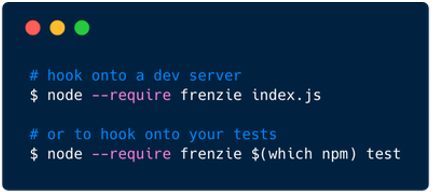

<p align="center">
  
</p>

<h3 align="center">Run chaos stuff in Node.js.</h3>

<p align="center">
  <a href="https://travis-ci.org/karimsa/frenzie">
    
  </a>

  <a href="https://codecov.io/gh/karimsa/frenzie">
    
  </a>

  
</p>

<p align="center">
  
</p>

**Table of Contents:**

 - [Configuration](#configuration)
 - [Supported Modules](#supported-modules)
 - [License](#license)

## Configuration

Put your config into a JSON file called `.frenzierc` file in your project root.

Each [supported module](#supported-modules) must be explicitly enabled. The name of
the module should be used as the key in the configuration object. For example, to enable
`mongodb`, your config file should be:

```json
{
  "mongodb": true
}
```

And to set specific configuration values:

```json
{
  "mongodb": {
    "enabled": true,
    "my-config-key": "some-value"
  }
}
```

For the possible configurations for each module, see the table below:

| Option name | Default | Possible values    | Description                                         |
|-------------|---------|--------------------|-----------------------------------------------------|
| `enabled`   | `false` | `true`, `false`    | Specifies whether to enable chaos for given module. |
| `threshold` | `0.5`   | any number below 1 | The probability of something chaotic occuring.      |
| `maxDelay`  | `100`   | any number         | Maximum amount of time to wait before actually doing something. Only used for asynchronous methods. |
| `maxTicks`  | `1e9`   | any number         | Maximum number to synchronously count up to before actually doing something. Only used for sychronous methods. Warning: this is done using a `for(;;);` - it's going to hang the entire event loop. |

## Supported Modules

{{= it.modules }}

## License

Licensed under [MIT license](LICENSE.md).

Copyright &copy; 2018-present Karim Alibhai.
