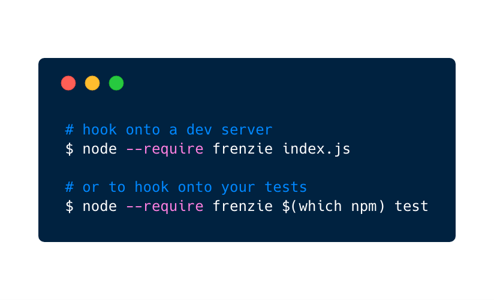

<p align="center">
  
</p>

<h3 align="center">Run chaos stuff in Node.js.</h3>

<p align="center">
  <a href="https://travis-ci.com/karimsa/frenzie">
    
  </a>

  <a href="https://codecov.io/gh/karimsa/frenzie">
    
  </a>

  
</p>

<p align="center">
  
</p>

**Table of Contents:**

 - [Configuration](#configuration)
 - [Learn More](#learn-more)
 - [Supported Modules](#supported-modules)
 - [License](#license)

## Configuration

Put your config into a JSON file called `.frenzierc` file in your project root.

Each [supported module](#supported-modules) must be explicitly enabled. The name of
the module should be used as the key in the configuration object. For example, to enable
`mongodb`, your config file should be:

```json
{
  "mongodb": true
}
```

And to set specific configuration values:

```json
{
  "mongodb": {
    "enabled": true,
    "my-config-key": "some-value"
  }
}
```

For the possible configurations for each module, see the table below:

| Option name | Default value | Possible values       | Description                                         |
|-------------|---------------|-----------------------|-----------------------------------------------------|
| `enabled`   | `false`       | `true`, `false`       | Specifies whether to enable chaos for given module. |
| `strategy`  | `'random'`    | `'random'`, `'alternate'` | Specifies the strategy to use when enabling chaos in given module. |

## Learn More

`TODO.`

## Supported Modules

 - [dns](src/dns)

## License

Licensed under [MIT license](LICENSE.md).

Copyright &copy; 2018-present Karim Alibhai.
